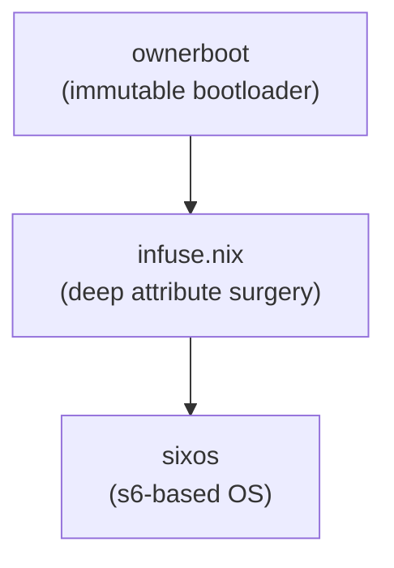

# SixOS – A Nix-based Operating System without systemd

## 1. Motivation

- Linux has always allowed users to pick their own kernel, tool-chain and utilities, yet in recent years the **init system** has converged on a single implementation: `systemd`.
- For users that value *small, auditable* code bases and a *stable* interface between user-space and PID 1, `systemd`'s fast-moving, sprawling surface can feel like a lock-in.
- **SixOS** began as Adam M. Joseph's personal attempt to regain that optionality while keeping the declarative power of Nix.  The result is a fully-featured distribution that boots with **s6-linux-init**, manages services with **s6-rc**, and re-imagines the NixOS module system with a much lighter construct called *infusions*.

## 2. The Layer Cake



1. **ownerboot** – optional boot-stack that embeds a pre-kexec kernel in SPI flash and implements *real* full-disk encryption.
2. **infuse** – a  single-file library that replaces most uses of overlays, `override` and the NixOS module system.
3. **sixos** – the top layer: service definitions, switch-to-configuration logic, and a small set of host *targets* that compile down to **s6-rc** databases.

## 3. ownerboot in a Nutshell

- Repository: <https://codeberg.org/amjoseph/ownerboot>
- Built on **coreboot**; the firmware chain ends in a *write-protected* kernel that immediately `kexec`s into the real runtime kernel.
- Authenticates the user, decrypts storage using *authenticated encryption*, then hands control over.
- Eliminates writable, unencrypted stages in the boot flow – something traditional BIOS/UEFI setups cannot guarantee.
- Boot assets live under `/nix/var/nix/profiles/bootflash`, making them subject to standard Nix roll-backs.

## 4. Infuse – Replacing Modules with Algebra

- Repository: <https://codeberg.org/amjoseph/infuse.nix>
- An **infusion** is a tree whose leaves are *functions*; merging two trees means *calling* these functions while recursing over identical structure.
- Ships with a set of sugar attributes (`__append`, `__prepend`, `__default`, …) that desugar to those functions.
- Guarantees several algebraic laws (commutativity, associativity, identity) – making  deep, programmatic edits predictable.
- Used everywhere in SixOS to configure packages **and** services with the *same* operator.

### 4.1 Why not overlays?

- Overlays only see *packages*, not services.
- They compose strictly *left-to-right* and lack a principled conflict resolution story.
- Infusions work on any Nix value (function, list, attrset) and allow you to treat "packages" and "units" uniformly.

### 4.2 Practical Infusion Examples

```nix
# Disable systemd support across multiple packages
(final: prev: infuse prev {
  systemdSupport = _: false;
  systemd = _: null;
  pulseaudio.__input.systemdSupport = _: false;
  pipewire.__input.systemdSupport = _: false;
})

# Deep configuration changes
xrdp.__output.passthru.xorgxrdp.__output.configureFlags.__append = [
  "--without-systemd"
  "--with-s6"
];

# Modify Python package overrides programmatically
python311.__input.packageOverrides.__overlay.dnspython.__output.doCheck = _: false;
```

## 5. SixOS Service Model

| Aspect            | NixOS (modules) | SixOS (infusions) |
| ----------------- | --------------- | ----------------- |
| Source form       | `options` + `merge` | ordinary Nix expressions |
| Scoping           | flat            | scoped fix-points (`makeScope`) |
| Re-configuration  | Python/Perl mix | tiny C helper around `s6-rc change` |
| Multiple instances| manual hacks   | automatic – just call the function twice |

Key idea: **services are derivations**.  When you `nix build .#host.vm`, the output is an *s6-rc database* that travels with the system closure.

### 5.1 Service Types and Implementation

SixOS services are built using several primitive types:

- **Longruns** – supervised processes (equivalent to systemd services)
- **Oneshots** – run-once scripts (like systemd oneshot units)  
- **Bundles** – collections of other services (like systemd targets)
- **Funnels** – stdout/stderr management for longruns

#### Example Service Definition

```nix
# six/by-name/sy/syslog/service.nix
{ lib, pkgs, six }:
six.mkFunnel {
  run = pkgs.writeScript "run" ''
    #!${pkgs.runtimeShell}
    exec 2>&1
    exec ${pkgs.s6}/bin/s6-socklog -t 60 -x /dev/log
  '';
}
```

#### Service Builders

- `six.mkService` – generic service builder
- `six.mkBundle` – bundle multiple services  
- `six.mkOneshot` – one-time setup scripts
- `six.mkFunnel` – supervised processes with integrated logging
- `six.mkLogger` – stdout/stderr handling

**mkFunnel – advanced options**

| Field | Purpose |
|-------|---------|
| `flag-newpidns` | Spawn the supervised process in a fresh PID namespace. Requires s6 ≥ 2.13.1. |
| `notification-fd` | File-descriptor number the service will write to when it is ready (propagated to s6's `–n` supervision flag). |
| `timeout-kill` | Milliseconds to wait after sending the down-signal before forcibly killing the service with `SIGKILL`. |
| `timeout-finish` | Maximum runtime (ms) allowed for the optional `./finish` script before it is killed. |
| `down-signal` | Signal to send to the supervised process when stopping the service. |
| `finish` | Optional finish script that runs when the service stops. |

### 5.2 Service Dependencies

Services express dependencies through the `after` and `before` attributes **of the *instantiated* target derivation**.  You must always reference the other side of the edge via `final.targets.<name>` so that the path is unambiguous even when more than one instance of a service exists.

```nix
# overlays/default.nix (excerpt)

(final: prev: infuse prev {
  # Ensure the ssh daemon only starts once networking is up
  targets.sshd.__output.passthru.after.__append = [
    final.targets.network-online  # fully-qualified reference
  ];

  # The opposite direction can be expressed with `before` if desired –
  # convert-before-to-after.nix will normalise it for us.
  targets.network-online.__output.passthru.before.__append = [
    final.targets.sshd
  ];
})
```

Internally SixOS converts every `before` edge into the corresponding `after` edge (see the `convert-before-to-after` overlay), so specifying only one side is enough.

Unlike systemd's twelve dependency primitives, **s6-rc has exactly one**: everything that appears in a target's `after` list must be up before that target is allowed to start.

### 5.3 Utility layer

SixOS ships a handful of small helper functions that live under `six.util.*` and `util.*`.  They are not mandatory to use, but they make writing services and overlays much more pleasant.

| Helper | What it does | Typical use-site |
|--------|--------------|------------------|
| `six.util.chpst { … }` | Returns an **argv list** that encodes a full process-state setup (uid/gid switching, envdir, nice, chroot, …) using `execline` and `s6-*` primitives.  Because it returns a list you can pass it straight to `mkFunnel`'s `argv` field without having to shell-escape anything. | Building robust longrun run-scripts without hand-crafting `execline` chains. |
| `util.forall-hosts (overlayFn)` | Lifts a per-host overlay into a site-wide one.  `overlayFn` is called for every host as `(name → hostFinal → hostPrev → attrs)`.  Internally it also freezes the set of attribute names to avoid mysterious infinite recursions. | Any overlay that needs to adjust *every* host (e.g. add an architecture-specific kernel tweak). |
| `util.canonicalize` | Converts system strings to canonical GNU triple format. | Cross-compilation and architecture-specific package configuration. |
| `util.maybe-invoke-readTree` | Optionally applies readTree to path arguments, allowing hosts/tags to be passed as directories. | Site configuration where hosts/tags are stored as directory structures. |
| `util.apply-to-hosts` | Converts an overlay-on-hosts into an overlay-on-a-site. | Building overlays that modify host configurations. |
| `util.make-host-attrnames-deterministic` | Ensures host attrset names are statically determined to avoid infinite recursions. | Internal host configuration processing. |
| `uncaughtLogs` (fallback logger) | Defined inside `six.mkConfiguration`.  If a long-run service does **not** declare its own `passthru.logger`, SixOS automatically wires its stdout/stderr to an instance of this tiny logger (`s6-cat` into the global catch-all).  You can opt-out by setting `logger = false` in the service's `passthru`. | Keep logs around without thinking; disable for very chatty services. |

Example – using these helpers together:

```nix
my-service = six.mkFunnel {
  # Build argv via six.util.chpst so the process runs as user `nobody`
  argv = six.util.chpst {
    user = "nobody";
    envdir = "./env";
    argv = [ pkgs.my-daemon "--foreground" ];
  };

  # Don't create a default logger; we'll manage stdout ourselves.
  passthru.logger = false;
};
```

## 6. Runtime Stack

- **PID 1** – `s6-linux-init`
- **Supervision** – `s6-svc`
- **Dependency graph** – `s6-rc` (`start`, `stop`, `change`)
- **Device hot-plug** – `mdevd` + `libudev-zero`
- **User helpers** –
  - `s6-sudod`: privilege escalation *without* inheriting process state.
  - `doas`: the *only* set-uid binary on a SixOS box.
- **Initrd UX** – runs inside `abduco`, mirrored on both `tty0` and `ttyS0`; serial consoles "just work".

> **Implementation note**  –  `PID 1` is **built**, not downloaded.  The binary that eventually runs as PID 1 is produced by the `six.s6-linux-init` derivation.  At build-time you can tweak its behaviour via a handful of arguments:
>
> • `early-getty` – program (e.g. BusyBox `getty`) to spawn on the primary console as soon as the kernel jumps into user-space.  Useful for emergency shells or serial log-in.
>
> • `devtmpfs-mountpoint` – mount point for the early `/dev` tmpfs.  Defaults to `/dev`; set to `null` to let the kernel keep its own devtmpfs.
>
> • `default-timezone` – value baked into `$TZ` for every early userspace process.  Factory default is `PST8PDT,M3.2.0,M11.1.0` but can be any POSIX TZ string.
>
> • `final-sleep-time-ms` – how long s6-linux-init waits after finishing shutdown before issuing the final `poweroff`/`reboot` (milliseconds, default 3000).

### 6.1 s6-rc Database Compilation

Services compile to an s6-rc database through this process:

1. **Collection** – Services are collected from `six/by-name/*` directories
2. **Sorting** – Services sorted by dependency order
3. **Source Generation** – Individual service directories created
4. **Compilation** – `s6-rc-compile` creates the final database
5. **Integration** – Database linked into system closure

The compiled database contains:
- Service dependency graphs
- Timeout configurations  
- Logging pipelines
- Runtime state management

## 7. Security Posture

- **Zero setuid helpers** in the base system except `doas`.
- Privileged tasks like `mount`, `fusermount3`, `ping`, `passwd` are wrapped by small, audited s6 utilities.
- Full-disk encryption happens *before* any mutable storage is accessed.

## 8. Building Your Own SixOS-Based System: Complete Implementation Guide

### 8.1 Prerequisites and Dependencies

- **Advanced Nix expertise**: overlays, flakes, cross-compilation, infuse.nix operations
- **s6 ecosystem knowledge**: `s6`, `s6-rc`, `s6-linux-init`, `s6-supervise`
- **System internals**: initramfs, kernel configuration, device management
- **Required external dependencies**:
  - `infuse.nix` for algebraic configuration composition
  - `six-initrd` for initramfs construction  
  - `readTree` for service discovery and composition
  - `yants` for type validation
  - [Infuse – Deep Attribute Surgery for Nix](infuse.md#infuse--deep-attribute-surgery-for-nix)
  - [six-initrd – Advanced Initial RAM Disk Builder for Nix](six-initrd.md#six-initrd--advanced-initial-ram-disk-builder-for-nix)

### 8.2 System Architecture Overview

SixOS implements a **derivation-based service system** where:

1. **Services are derivations** that compile to s6-rc source directories
2. **Service builders** (`mkService`, `mkBundle`, `mkOneshot`, `mkFunnel`, `mkLogger`) create s6-rc compatible structures
3. **Automatic service discovery** via `by-name` directory structure
4. **Dependency resolution** through `after`/`before` attributes
5. **Configuration composition** using infuse.nix overlay system
6. **Runtime compilation** to s6-rc databases at system build time

### 8.3 Core System Components

#### 8.3.1 Service Definition Architecture

Services follow the **`by-name` structure**:

```
six/by-name/
├── ss/sshd/service.nix         # SSH daemon
├── sy/syslog/service.nix       # System logging
├── mo/mount/service.nix        # Filesystem mounting
└── md/mdevd/service.nix        # Device management
```

**Service builders available**:

- `six.mkService` - Generic service with configurable type
- `six.mkBundle` - Groups of services (like systemd targets)  
- `six.mkOneshot` - Run-once setup scripts
- `six.mkFunnel` - Supervised processes with integrated logging
- `six.mkLogger` - Log processing services

#### 8.3.2 Service Implementation Details

**Service derivation structure** (from `mkService.nix`):
```nix
# Each service becomes a derivation with:
# $out/type              - "longrun", "oneshot", or "bundle"
# $out/up                - startup script (if applicable)  
# $out/down              - shutdown script (if applicable)
# $out/timeout-up        - startup timeout in milliseconds
# $out/timeout-down      - shutdown timeout in milliseconds
# $out/dependencies.d/   - directory with dependency files
# $out/producer-for      - logging producer reference (longruns)
```

**Critical implementation details**:
- Services reference dependencies via `final.targets.service-name`
- The `passthru.spath` attribute tracks service path for s6-rc compilation
- Before/after relationships are resolved during configuration compilation
- Loggers are automatically created for longrun services unless disabled

#### 8.3.3 System Configuration Architecture

**Configuration Flow** (from `default.nix` and `configuration.nix`):

1. **Host Definition**: Site configurations define hosts with tags, interfaces, and boot parameters
2. **Overlay Application**: Multiple overlay stages configure packages, services, and architecture specifics
3. **Service Collection**: Services are discovered from `by-name` directories and instantiated
4. **Dependency Resolution**: Before/after relationships are resolved into a dependency graph
5. **s6-rc Compilation**: Service derivations are compiled into an s6-rc database
6. **System Assembly**: Final system derivation links kernel, initrd, services, and activation scripts

**Key overlay stages**:
```nix
overlays = [
  # 1. Package modifications (systemd removal, feature disabling)
  pkgs-overlay
  
  # 2. Base service targets (mounts, network, device management)  
  base-services-overlay
  
  # 3. Architecture-specific configurations
  arch-overlay
  
  # 4. Initrd contents and boot configuration
  initrd-overlay
  
  # 5. Tag-based conditional configurations
  tags-overlay
  
  # 6. Service path assignment (must be last before dependency resolution)
  add-spaths-overlay
  
  # 7. Logger creation for longrun services
  add-loggers-overlay
  
  # 8. Dependency resolution (before -> after conversion)
  convert-before-to-after-overlay
]
```

#### 8.3.4 Initrd Implementation Deep Dive

**Initrd Architecture** (from `initrd.nix`):

SixOS uses a **layered initrd approach**:

1. **Base Layer** (`six-initrd.minimal`): Essential initramfs with busybox and basic tools
2. **Console Multiplexing** (`six-initrd.abduco`): Multi-tty support for console and serial
3. **Feature Layers**: Cryptsetup, LVM, module loading, network setup

The set of **TTYs** that should display the initrd user-interface is configured via `boot.initrd.ttys`, an attribute set that maps device names (without `/dev/`) to an optional baud-rate:

```nix
boot.initrd.ttys = {
  tty0  = null;     # VGA console
  ttyS0 = 115200;   # serial console at 115200 baud
};
```
These values are handed to `six-initrd.abduco`, which wraps the early userspace program in **abduco** so that the same output is **mirrored** on every listed TTY.  That means everything that happens before the real root is mounted – password prompts, kernel logs, debug shell – shows up on both the local screen *and* the serial port.

The _last_ entry in `boot.initrd.ttys` is also forwarded to the later `six.s6-linux-init` stage, ensuring that PID 1 continues to treat that device as `/dev/console` and that an `early-getty` (if configured) appears there.  In other words: set the order of the map to control which console becomes primary.

**Tip:** omit `tty0` on headless machines and you will get a serial-only boot with zero changes elsewhere.

**Critical initrd components**:
```nix
# Generated initrd structure:
/
├── early/
│   ├── run      # Main initrd logic (modular, tag-based)
│   ├── finish   # Switch to real root (handles configuration selection)
│   └── fail     # Error recovery (drops to shell)
├── sbin/
│   ├── cryptsetup  # Static binary for LUKS
│   ├── lvm         # Static LVM tools  
│   └── dmsetup     # Device mapper
├── lib/modules/    # Kernel modules (linked from boot.kernel.modules)
└── etc/
    └── modprobe.conf  # Hardware-specific module blacklists
```

**Initrd Script Construction** (automatic composition):
```nix
# early/run is built by concatenating:
boot.initrd.contents."early/run".__append = [
  # Module loading (architecture-specific)
  "modprobe ext4 || true"
  "modprobe btrfs || true"
  
  # Hardware-specific initialization (tag-based)
  ] ++ lib.optionals host.tags.is-kgpe [
    "modprobe ehci_hcd"
    "modprobe sd_mod" 
  ] ++ [
  
  # Encrypted storage setup (conditional)
  ] ++ lib.optionals (!host.tags.is-nfsroot) [
    ''cryptsetup luksOpen --key-file /miniboot-cryptsetup-keyfile $DEV miniboot-root''
  ] ++ [
  
  # LVM activation
  "/sbin/lvm lvchange -a ay @boot"
  
  # Root filesystem mounting
  "mount -o ro LABEL=boot /root || exit 1"
];

# early/finish handles configuration selection:
boot.initrd.contents."early/finish".__append = [''
  CONFIGURATION=/nix/var/nix/profiles/nextboot
  # Parse kernel command line for configuration= parameter
  set -- $(cat /proc/cmdline)
  for x in "$@"; do
    case "$x" in
      configuration=*) CONFIGURATION="''${x#configuration=}" ;;
    esac
  done
  # Switch to selected configuration
  exec switch_root /root $CONFIGURATION/boot/init
''];
```

#### 8.3.5 Service Definition Implementation

**Service Discovery System** (from `six/default.nix`):

```nix
# Automatic service collection from by-name directories:
services = lib.pipe ([./by-name] ++ extra-by-name-dirs) [
  (map (dir: pipe dir [
    builtins.readDir
    # Keep only two-letter directories
    (filterAttrs (name: type: type == "directory" && stringLength name == 2))
    # Read each stem directory  
    (mapAttrs (stem: _: builtins.readDir (dir + "/${stem}")))
    (mapAttrs (stem: stemdir: pipe stemdir [
      # Filter subdirectories matching stem prefix
      (filterAttrs (fulldirname: fulldirtype:
        fulldirtype == "directory" && substring 0 2 fulldirname == stem))
      # Import service.nix from each valid directory
      (mapAttrs (fulldirname: _: import (dir + "/${stem}/${fulldirname}/service.nix")))
    ]))
    builtins.attrValues
    lib.attrsets.mergeAttrsList
    lib.attrsToList
  ]))
  lib.concatLists
  lib.listToAttrs
];
```

**Service Types and Builders**:

1. **mkService** - The fundamental service builder:
```nix
# six/mkService.nix implementation details:
six.mkService {
  type = "longrun" | "oneshot" | "bundle";
  
  # Startup/shutdown scripts (paths or derivations)
  up = pkgs.writeScript "run" "#!/bin/sh\nexec my-daemon";
  down = pkgs.writeScript "down" "#!/bin/sh\nkill-daemon";
  
  # Timeouts in milliseconds
  timeout-up = 10000;     # 10 seconds
  timeout-down = 5000;    # 5 seconds
  
  # Service metadata and dependencies
  passthru = {
    after = [ final.targets.network-online ];    # Start after these
    before = [ final.targets.default ];          # Start before these
    essential = true;                             # Critical service flag
    logger = false;                               # Disable auto-logging
  };
}
```

2. **mkFunnel** - Supervised process with integrated logging:
```nix
# Combines mkService with automatic log routing
six.mkFunnel {
  run = "${pkgs.nginx}/bin/nginx -g 'daemon off;'";
  # Automatically creates and connects to a logger service
}
```

3. **mkOneshot** - Run-once setup scripts:
```nix
six.mkOneshot {
  up = pkgs.writeScript "setup" "#!/bin/sh\nmkdir -p /var/log";
  down = pkgs.writeScript "teardown" "#!/bin/sh\nrm -rf /tmp/setup";
}
```

4. **mkBundle** - Service groups (like systemd targets):
```nix
six.mkBundle {
  passthru.after = [ 
    final.targets.network-online 
    final.targets.sshd 
    final.targets.syslog 
  ];
}
```

**Real Service Examples**:

```nix
# SSH daemon (six/by-name/ss/sshd/service.nix)
{ lib, six, pkgs, listen-port ? 22, package ? pkgs.openssh }:
let
  configFile = builtins.toFile "sshd_config" ''
    Port ${toString listen-port}
    PermitRootLogin yes
    X11Forwarding yes
    # ... more config
  '';
in six.mkFunnel {
  run = pkgs.writeScript "run" ''
    #!${pkgs.runtimeShell}
    exec 2>&1
    
    # Setup directories
    mkdir -p -m 0755 /var/empty /run/sshd /etc/ssh
    
    # Generate host keys if missing
    ssh-keygen -A -f ./
    
    exec ${package}/bin/sshd -e -4 -D -f ${configFile}
  '';
}

# Mount service (six/by-name/mo/mount/service.nix)  
{ lib, pkgs, six, where, what ? "none", fstype ? null, 
  options ? [], create-mountpoint ? false }:
six.mkOneshot {
  up = pkgs.writeScript "mount-up" ''
    #!${pkgs.runtimeShell} -e
    ${lib.optionalString create-mountpoint 
      "${pkgs.busybox}/bin/mkdir -m 0000 -p ${where}"}
    ${pkgs.busybox}/bin/mount ${lib.escapeShellArgs (
      lib.optionals (options != []) ["-o" (lib.concatStringsSep "," options)] ++
      lib.optionals (fstype != null) ["-t" fstype] ++
      [what where]
    )}
  '';
  
  down = pkgs.writeScript "mount-down" ''
    #!${pkgs.runtimeShell}
    ${pkgs.busybox}/bin/umount ${where} || true
  '';
  
  passthru = {
    inherit what where fstype options;
    before = [ final.targets.global.mounts ];
    after = lib.optionals (fstype != "proc" && fstype != "sysfs") [
      final.targets.mounts.proc  # Need /proc for modprobe
    ];
  };
}

# Device management (six/by-name/md/mdevd/service.nix)
{ lib, pkgs, six, conf }:
six.mkService {
  type = "longrun";
  up = "${pkgs.mdevd}/bin/mdevd -D 3 -b 3:3 -f ${conf}";
  passthru.after = [ final.targets.mounts.proc final.targets.mounts.sys ];
}
```

#### 8.3.6 Complete Host Configuration Architecture

**System Configuration Flow** (from `six/mkConfiguration.nix`):

```nix
# six.mkConfiguration builds a complete system through these stages:

1. Service Collection and Instantiation:
   sorted-collected-services = lib.pipe overlays [
     (lib.composeManyExtensions ([init] ++ overlays ++ [
       add-spaths        # Assign service paths for s6-rc  
       add-loggers       # Create loggers for longrun services
       convert-before-to-after  # Resolve dependency graph
     ]))
     (lib.makeScope lib.callPackageWith).overrideScope
     flatten           # Convert nested services to flat list
     (lib.sort (a: b: (lib.concatStringsSep "." a.spath) < 
                      (lib.concatStringsSep "." b.spath)))
   ];

2. s6-rc Source Generation:
   source = pkgs.runCommand "s6-rc-source" {} ''
     mkdir -p $out
     ${lib.concatMapStrings (target: ''
       mkdir -p $out/${lib.concatStringsSep "." target.passthru.spath}
       ln -s ${target.outPath}/* -t $out/${lib.concatStringsSep "." target.passthru.spath}/
     '') sorted-collected-services}
     
     # Create consumer-for links (reverse of producer-for)
     ${lib.concatMapStrings (target: ''
       if [ -e "${target.outPath}/producer-for" ]; then
         echo ${lib.concatStringsSep "." target.passthru.spath} >> \
           $out/$(cat ${target.outPath}/producer-for)/consumer-for
       fi
     '') sorted-collected-services}
   '';

3. s6-rc Database Compilation:
   compiled = pkgs.runCommand "s6-rc-compiled" {} ''
     mkdir -p $out/six/s6-rc
     ln -s ${source} $out/six/s6-rc/source
     ${pkgs.s6-rc}/bin/s6-rc-compile \
       ${lib.optionalString (verbosity!=null) "-v ${toString verbosity}"} \
       $out/six/s6-rc/db ${source}
   '';

4. System Assembly with Activation Scripts:
   configuration = pkgs.runCommand "six-system-${hostname}" {} ''
     mkdir -p $out
     
     # Link s6-rc database and scandir
     ln -s ${compiled}/six/s6-rc/db $out/six/s6-rc/db
     ln -s ${scandir} $out/six/scandir
     
     # Create activation script
     cat > $out/bin/activate <<'EOF'
     #!/bin/sh -e
     if [[ -d /run/s6-rc ]]; then
       # System is running - perform live update
       ${pkgs.s6-rc}/bin/s6-rc-update -v 8 ${compiled}/six/s6-rc/db
       ${pkgs.s6-portable-utils}/bin/s6-ln -sfn ${builtins.placeholder "out"} /run/current-system
     else
       # First boot - initialize everything
       ${pkgs.s6-portable-utils}/bin/s6-ln -sfn ${builtins.placeholder "out"} /run/booted-system
       ${pkgs.s6-portable-utils}/bin/s6-ln -sfn ${builtins.placeholder "out"} /run/current-system
       mkdir -p ${scandir}
       ${pkgs.s6-rc}/bin/s6-rc-init -d -c $out/six/s6-rc/db ${scandir}
       exec ${pkgs.s6-rc}/bin/s6-rc -v2 -up change ${default-runlevel}
     fi
     EOF
     
     # Boot components (kernel, initrd, init)
     ln -sT ${boot.kernel.payload} $out/boot/kernel
     ln -sT ${boot.initrd.image} $out/boot/initrd
     ln -sT ${s6-linux-init-cpio}/boot/init $out/boot/init
     
     # Software environment
     ${lib.optionalString (sw != null) "ln -s ${sw} $out/sw"}
   '';
```

**Flake-based System Definition**:

```nix
# Complete flake.nix for s6-based system
{
  description = "Custom s6-based OS";
  
  inputs = {
    nixpkgs.url = "github:nixos/nixpkgs/nixos-unstable";
    infuse.url = "https://codeberg.org/amjoseph/infuse.nix";
    six-initrd.url = "https://codeberg.org/amjoseph/six-initrd";
    six.url = "https://codeberg.org/amjoseph/six";
  };
  
  outputs = { self, nixpkgs, infuse, six-initrd, six }: 
    let
      system = "x86_64-linux";
      
      # Apply systemd removal overlays
      pkgs = nixpkgs.legacyPackages.${system}.extend (
        final: prev: (infuse.lib.infuse { inherit (nixpkgs) lib; }).v1.infuse prev {
          # Global systemd disabling
          systemdSupport.__assign = false;
          systemd.__assign = prev.libudev-zero;
          udev.__assign = prev.libudev-zero;
          
          # Disable features that pull in systemd
          pulseaudioSupport.__assign = false;
          pipewireSupport.__assign = false;
          dbusSupport.__assign = false;
          polkitSupport.__assign = false;
          
          # Package-specific overrides
          openssh.__input.withPAM.__assign = false;
          lvm2.__input.udevSupport.__assign = false;
          util-linux.__input.pamSupport.__assign = false;
        }
      );
      
      # Create site configuration
      site = {
        hosts.mysystem = { name, host, site, pkgs, ... }: {
          canonical = "x86_64-unknown-linux-gnu";
          
          # Boot configuration  
          boot = {
            kernel = {
              package = pkgs.callPackage ./kernel.nix {};
              payload = "${final.boot.kernel.package}/bzImage";
              params = [ "root=LABEL=boot" "ro" "console=ttyS0,115200" ];
              console = { device = "ttyS0"; baud = 115200; };
              firmware = [ pkgs.linux-firmware ];
            };
            
            initrd = {
              image = six-initrd.lib.abduco {
                inherit (nixpkgs) lib;
                inherit pkgs;
                ttys = { tty0 = null; ttyS0 = "115200"; };
              };
            };
          };
          
          # Software environment
          sw = pkgs.buildEnv {
            name = "system-path";
            paths = with pkgs; [
              busybox coreutils bash openssh nano
              e2fsprogs util-linux cryptsetup lvm2
            ];
          };
          
          # Tags for conditional features
          tags = {
            is-workstation = true;
            has-wifi = true;
            is-nfsroot = false;
          };
          
          # Service overlays (applied after base services)
          service-overlays = [
            (final: prev: infuse prev {
              targets.sshd.__output.passthru.after.__append = [ 
                final.targets.network-online 
              ];
              targets.custom-app = _: final.services.my-app {
                port = 8080;
                config-file = "/etc/my-app.conf";
              };
            })
          ];
        };
        
        # Global site configuration
        globals = {};
        overlay = [];
        tags = {
          is-workstation = (host-final: host-prev: {
            targets.sway = _: host-final.services.sway {};
            targets.seatd = _: host-final.services.seatd {};
          });
          has-wifi = (host-final: host-prev: {
            targets.eiwd = _: host-final.services.eiwd {};
          });
        };
        subnets = {};
      };
      
    in {
      # Build the complete system
      packages.${system}.default = (six.lib.make { 
        inherit (nixpkgs) lib;
        inherit pkgs infuse six-initrd;
        inherit site;
      }).host.mysystem.configuration;
      
      # VM for testing
      packages.${system}.vm = self.packages.${system}.default.vm;
      
      # ISO image
      packages.${system}.iso = pkgs.stdenv.mkDerivation {
        name = "sixos-${system}.iso";
        buildInputs = [ pkgs.squashfs-tools pkgs.syslinux pkgs.genisoimage ];
        
        buildPhase = ''
          mkdir -p iso/{boot,live}
          
          # Copy boot components
          cp ${self.packages.${system}.default}/boot/kernel iso/boot/vmlinuz  
          cp ${self.packages.${system}.default}/boot/initrd iso/boot/initrd
          
          # Create root filesystem
          mksquashfs ${self.packages.${system}.default} iso/live/filesystem.squashfs
          
          # Setup bootloader
          mkdir -p iso/boot/syslinux
          cp ${pkgs.syslinux}/share/syslinux/{isolinux.bin,ldlinux.c32} iso/boot/syslinux/
          
          cat > iso/boot/syslinux/syslinux.cfg <<EOF
          default sixos
          timeout 30
          
          label sixos
            kernel /boot/vmlinuz
            append initrd=/boot/initrd boot=live
          EOF
        '';
        
        installPhase = ''
          genisoimage -o $out \
            -b boot/syslinux/isolinux.bin \
            -c boot/syslinux/boot.cat \
            -no-emul-boot -boot-load-size 4 -boot-info-table \
            -V "SixOS" -A "SixOS ${system}" \
            iso/
        '';
      };
    };
}
```

### 8.4 Critical Implementation Details

#### 8.4.1 Comprehensive Systemd Removal Strategy

**Core systemd replacement** (from `pkgs/overlays.nix`):

```nix
# The fundamental systemd replacement strategy:
systemdRemovalOverlay = final: prev: infuse prev {
  # Replace systemd with libudev-zero everywhere
  systemdMinimal.__assign = prev.libudev-zero;
  systemd.__assign = prev.libudev-zero;
  udev.__assign = prev.libudev-zero;
  
  # Global feature disabling
  systemdSupport.__assign = false;
  enableSystemd.__assign = false;
  pulseaudioSupport.__assign = false;
  pipewireSupport.__assign = false;
  withPulseAudio.__assign = false;
  usePulseAudio.__assign = false;
  dbusSupport.__assign = false;
  withDbus.__assign = false;
  polkitSupport.__assign = false;
  enablePolkit.__assign = false;
  withPolkit.__assign = false;
  pamSupport.__assign = false;
  usePam.__assign = false;
  
  # Critical package-specific overrides
  openssh.__input = {
    etcDir.__assign = "/etc";
    withKerberos.__assign = false;
    withFIDO.__assign = false;
    withPAM.__assign = false;
    pam.__assign = null;
  };
  
  # LVM without udev
  lvm2.__input.udevSupport.__assign = false;
  lvm2.__output.configureFlags.__append = [
    "--disable-udev_sync"
    "--enable-udev_rules"
    "--enable-udev-rule-exec-detection"
  ];
  
  # Essential utilities without systemd
  util-linux.__input.pamSupport.__assign = false;
  shadow.__input.pam.__assign = null;
  doas.__input.withPAM.__assign = false;
  
  # Audio system replacements
  libpulseaudio.__assign = null;
  
  # Graphics without systemd dependencies
  SDL2.__input.udevSupport.__assign = false;
  
  # Disable problematic packages entirely
  umockdev.__assign = null;
  secretstorage.__assign = null;
  
  # Networking without NetworkManager/systemd
  networkmanager.__assign = null;  # Use manual network configuration
  
  # Security adjustments
  libgcrypt.__output.configureFlags.__append = [ "--disable-jent-support" ];
  
  # Python package ecosystem fixes
  python311.__input.packageOverrides.__overlay = {
    secretstorage.__assign = null;   # Breaks many Python apps
    btchip.__assign = null;          # Hardware wallet support
    pyscard.__assign = null;         # Smart card support
  };
};
```

#### 8.4.2 Device Management Without systemd-udev

**mdevd replacement system**:

```nix
# Device management configuration (mdev-conf.nix)
mdev-conf = pkgs.writeText "mdev.conf" ''
  # Basic device creation rules for mdevd
  console   root:tty 600 @mkdir -p -m 755 /dev/pts
  null      root:root 666
  zero      root:root 666
  full      root:root 666
  random    root:root 644
  urandom   root:root 644
  
  # TTY devices
  tty       root:tty 666
  tty[0-9]* root:tty 660
  pty.*     root:tty 660
  
  # Block devices
  [hs]d[a-z][0-9]* root:disk 660 @mkdir -p /dev/disk/by-id
  nvme[0-9]*n[0-9]*p[0-9]* root:disk 660
  dm-[0-9]* root:disk 660 @mkdir -p /dev/mapper
  
  # Network interfaces  
  net/.*    root:root 600 @/sbin/mdev-net-helper
  
  # USB devices
  ttyUSB[0-9]* root:uucp 660 @mkdir -p /dev/serial/by-id
  ttyACM[0-9]* root:uucp 660
  
  # Input devices
  input/.*  root:input 640 @mkdir -p /dev/input/by-path
  
  # DRM devices (graphics)
  dri/.*    root:video 660 @mkdir -p /dev/dri
  
  # Sound devices  
  snd/.*    root:audio 660 @mkdir -p /dev/snd
'';

# mdevd service implementation
mdevd-service = six.mkService {
  type = "longrun";
  up = "${pkgs.mdevd}/bin/mdevd -D 3 -b 3:3 -f ${mdev-conf}";
  passthru.after = [ final.targets.mounts.proc final.targets.mounts.sys ];
};

# Coldplug existing devices
mdevd-coldplug = six.mkOneshot {
  up = pkgs.writeScript "coldplug" ''
    #!${pkgs.runtimeShell}
    # Trigger mdevd to process existing devices
    ${pkgs.busybox}/bin/find /sys -name uevent -exec /bin/echo add '{}' \;
  '';
  passthru.after = [ final.targets.mdevd ];
};
```

#### 8.4.3 Kernel Configuration for s6 Systems

(Invariant)  The **kernel modules** that actually get loaded always come from the *booted* configuration (`/run/booted-system/kernel-modules`), while the `modprobe` **binary** used to load them is a small wrapper (`modprobe-wrapped`) taken from the *current* configuration – that way `nix run .#activate` never breaks module loading for the already-running kernel.

**Custom kernel requirements** (from `kernel.nix`):

```nix
# Critical kernel options for s6-based systems:
kernelConfig = with lib.kernel; {
  # s6-linux-init requirements
  EXPERT = yes;
  KEXEC = lib.mkForce yes;          # For system switching
  
  # Initramfs support
  RD_XZ = lib.mkForce (option yes);
  KERNEL_XZ = lib.mkForce (option yes);
  MODULE_COMPRESS_XZ = lib.mkForce (option yes);
  
  # Disable systemd-specific features
  USER_NS = lib.mkForce no;         # User namespaces (systemd dependency)
  IPV6 = lib.mkForce (option no);   # Simplify networking
  
  # Essential filesystems
  BTRFS_FS = yes;
  EXT4_FS = yes;
  
  # Device management
  DEVTMPFS = yes;                   # Required for mdevd
  UEVENT_HELPER_PATH = freeform "/sbin/mdev";  # Default helper
  
  # Cryptography support
  ENCRYPTED_KEYS = module;
  DM_CRYPT = module;
  
  # Network requirements for s6
  WIREGUARD = module;               # VPN support
  NETFILTER = yes;                  # Basic firewalling
  NET_UDP_TUNNEL = module;          # Wireguard dependency
  
  # USB support (common requirement)
  USB_UAS = lib.mkForce yes;        # USB storage
  USB_ACM = module;                 # Serial consoles
  USB_SERIAL = lib.mkForce module;
  
  # Architecture-specific optimizations
} // lib.optionalAttrs stdenv.hostPlatform.isx86_64 {
  # x86_64-specific optimizations
  MK8 = yes;                        # AMD CPU type
  SENSORS_K10TEMP = module;         # AMD temperature monitoring
  E1000E = module;                  # Intel Ethernet
  
} // lib.optionalAttrs stdenv.hostPlatform.isAarch64 {
  # ARM64-specific requirements
  ARM64_VA_BITS_48 = yes;
  
} // lib.optionalAttrs stdenv.hostPlatform.isMips {
  # MIPS-specific settings
  CPU_LITTLE_ENDIAN = yes;
  CAVIUM_OCTEON_CVMSEG_SIZE = freeform "0";
};
```

#### 8.4.4 Network Configuration Without NetworkManager

**Manual network management**:

```nix
# Network interface service (replaces NetworkManager)
netif-service = { ifname, address ? null, netmask ? null, 
                  gateway ? null, type ? "ethernet" }: 
six.mkOneshot {
  up = pkgs.writeScript "netif-up" ''
    #!${pkgs.runtimeShell} -e
    
    # Basic interface setup
    ${pkgs.iproute2}/bin/ip link set ${ifname} up
    
    ${lib.optionalString (address != null && netmask != null) ''
      # Static IP configuration
      ${pkgs.iproute2}/bin/ip addr add ${address}/${toString netmask} dev ${ifname}
    ''}
    
    ${lib.optionalString (gateway != null) ''
      # Default route
      ${pkgs.iproute2}/bin/ip route add default via ${gateway} dev ${ifname}
    ''}
    
    ${lib.optionalString (type == "loopback") ''
      # Loopback interface
      ${pkgs.iproute2}/bin/ip addr add 127.0.0.1/8 dev ${ifname}
    ''}
  '';
  
  down = pkgs.writeScript "netif-down" ''
    #!${pkgs.runtimeShell}
    ${pkgs.iproute2}/bin/ip link set ${ifname} down
  '';
  
  passthru = {
    after = [ final.targets.global.coldplug ];  # Wait for device detection
    before = [ final.targets.network-online ];
  };
};

# WireGuard VPN service
wireguard-service = { ifname, private-key-filename, address, 
                     listen-port ? 51820, peers ? {}, mtu ? 1420 }:
six.mkOneshot {
  up = pkgs.writeScript "wg-up" ''
    #!${pkgs.runtimeShell} -e
    
    # Create WireGuard interface
    ${pkgs.iproute2}/bin/ip link add dev ${ifname} type wireguard
    ${pkgs.iproute2}/bin/ip addr add ${address} dev ${ifname}
    
    # Configure WireGuard
    ${pkgs.wireguard-tools}/bin/wg set ${ifname} \
      private-key ${private-key-filename} \
      listen-port ${toString listen-port}
    
    ${lib.concatMapStrings (peer: ''
      ${pkgs.wireguard-tools}/bin/wg set ${ifname} peer ${peer.pubkey} \
        allowed-ips ${lib.concatStringsSep "," peer.allowed-ips} \
        ${lib.optionalString (peer?endpoint) "endpoint ${peer.endpoint}"} \
        ${lib.optionalString (peer?keepalive) "persistent-keepalive ${toString peer.keepalive}"}
    '') (builtins.attrValues peers)}
    
    # Bring interface up
    ${pkgs.iproute2}/bin/ip link set ${ifname} mtu ${toString mtu} up
  '';
  
  down = pkgs.writeScript "wg-down" ''
    #!${pkgs.runtimeShell}
    ${pkgs.iproute2}/bin/ip link del dev ${ifname} || true
  '';
  
  passthru.after = [ final.targets.network-online ];
};
```

#### Device Management

Replace systemd-udev with alternatives:

```nix
# Use mdevd for device management
deviceManagerService = six.mkService {
  type = "longrun";
  run = pkgs.writeScript "mdevd-run" ''
    #!${pkgs.runtimeShell}
    exec ${pkgs.mdevd}/bin/mdevd -D 3 -b 3:3
  '';
  passthru.after = [ "coldplug" ];
};
```

#### Network Management

Implement network services without NetworkManager/systemd:

```nix
networkService = six.mkOneshot {
  up = pkgs.writeScript "network-up" ''
    #!${pkgs.runtimeShell}
    ${pkgs.iproute2}/bin/ip link set dev eth0 up
    ${pkgs.iproute2}/bin/ip addr add 192.168.1.100/24 dev eth0
    ${pkgs.iproute2}/bin/ip route add default via 192.168.1.1
  '';
  down = pkgs.writeScript "network-down" ''
    #!${pkgs.runtimeShell}
    ${pkgs.iproute2}/bin/ip link set dev eth0 down
  '';
};
```

### 8.4 ISO Building

Create a bootable ISO:

```nix
# Build an ISO with your s6 system
myIso = pkgs.stdenv.mkDerivation {
  name = "sixos-custom.iso";
  
  buildInputs = [ pkgs.squashfs-tools pkgs.syslinux pkgs.genisoimage ];
  
  buildPhase = ''
    # Create filesystem structure
    mkdir -p iso/{boot,live}
    
    # Copy kernel and initrd
    cp ${mySystem.boot.kernel.payload} iso/boot/vmlinuz
    cp ${mySystem.boot.initrd.image} iso/boot/initrd
    
    # Create squashfs root
    mksquashfs ${mySystem} iso/live/filesystem.squashfs
    
    # Setup bootloader
    mkdir -p iso/boot/syslinux
    cp ${pkgs.syslinux}/share/syslinux/*.c32 iso/boot/syslinux/
    
    cat > iso/boot/syslinux/syslinux.cfg <<EOF
    default sixos
    label sixos
      kernel /boot/vmlinuz
      append initrd=/boot/initrd boot=live
    EOF
  '';
  
  installPhase = ''
    # Create final ISO
    genisoimage -o $out \
      -b boot/syslinux/isolinux.bin \
      -c boot/syslinux/boot.cat \
      -no-emul-boot -boot-load-size 4 -boot-info-table \
      iso/
  '';
};
```

### 8.5 Debugging, Troubleshooting, and Common Pitfalls

#### 8.5.1 Service System Debugging

**s6-rc service state inspection**:

```bash
# Check service states
s6-rc -a list      # All services
s6-rc -u list      # Running services  
s6-rc -d list      # Stopped services

# Service information
s6-rc-db list /run/current-system/six/s6-rc/db      # All available services
s6-rc-db contents /run/current-system/six/s6-rc/db sshd     # Service contents
s6-rc-db dependencies /run/current-system/six/s6-rc/db sshd # Dependencies

# Log inspection
s6-svstat /run/service/*/       # All service states
s6-svstat /run/service/sshd/    # Specific service state
s6-tail /run/service/sshd/      # Follow service logs
```

**Common service failure patterns**:

1. **Timeout Failures**:
```nix
# Debugging timeouts
six.mkService {
  type = "longrun";
  timeout-up = 30000;    # 30 seconds (default 5000)
  timeout-down = 10000;  # 10 seconds (default 5000)
  up = pkgs.writeScript "debug-startup" ''
    #!${pkgs.runtimeShell}
    exec 2>&1              # Redirect stderr to stdout for logging
    set -x                 # Enable script debugging
    
    echo "Starting service at $(date)"
    
    # Slow startup simulation
    sleep 2
    
    # Your actual service command
    exec your-daemon
  '';
};
```

2. **Dependency Issues**:
```nix
# Debug dependency resolution
six.mkService {
  type = "longrun";
  up = pkgs.writeScript "debug-deps" ''
    #!${pkgs.runtimeShell}
    exec 2>&1
    
    # Check required dependencies
    echo "Checking dependencies..."
    
    # Test network availability
    if ! ${pkgs.iproute2}/bin/ip route | grep -q default; then
      echo "ERROR: No default route found"
      exit 1
    fi
    
    # Test filesystem mounts
    if ! mountpoint -q /var; then
      echo "ERROR: /var not mounted"
      exit 1
    fi
    
    exec your-service
  '';
  passthru.after = [ 
    final.targets.network-online 
    final.targets.mounts.""      # Root remounted read-write
  ];
};
```

3. **Script Execution Issues**:
```nix
# Common script problems and solutions
six.mkService {
  type = "longrun";
  up = pkgs.writeScript "robust-service" ''
    #!${pkgs.runtimeShell}
    exec 2>&1                    # Merge stderr with stdout
    
    # Set strict error handling
    set -euo pipefail
    
    # Create required directories
    mkdir -p /var/log/myservice /run/myservice
    chown nobody:nobody /var/log/myservice
    
    # Wait for required files/services
    timeout=60
    while [ $timeout -gt 0 ] && [ ! -e /etc/myservice.conf ]; do
      echo "Waiting for config file..."
      sleep 1
      timeout=$((timeout - 1))
    done
    
    if [ ! -e /etc/myservice.conf ]; then
      echo "FATAL: Config file not found after 60s"
      exit 1
    fi
    
    # Use exec for proper signal handling
    exec ${pkgs.myservice}/bin/myservice \
      --config /etc/myservice.conf \
      --foreground \
      --log-to-stderr
  '';
};
```

#### 8.5.2 System Boot Debugging

**Initrd debugging techniques**:

```nix
# Debug initrd with comprehensive logging
boot.initrd.contents."early/run".__append = [''
  # Enable debug output
  set -x
  exec 2>&1
  
  # Log all output to a file for post-boot analysis
  exec > >(tee /tmp/initrd-debug.log) 2>&1
  
  # Show kernel command line
  echo "=== Kernel Command Line ==="
  cat /proc/cmdline
  
  # Show available block devices
  echo "=== Block Devices ==="
  ls -la /dev/[hs]d* /dev/nvme* /dev/dm-* 2>/dev/null || true
  
  # Show loaded modules
  echo "=== Loaded Modules ==="
  lsmod
  
  # Test cryptsetup
  echo "=== LUKS Devices ==="
  blkid | grep crypto_LUKS || echo "No LUKS devices found"
  
  # Your actual initrd logic here
  for DEV in $(blkid | grep 'TYPE="crypto_LUKS"' | cut -d: -f1); do
    echo "Attempting to unlock $DEV"
    if cryptsetup luksDump "$DEV" | grep -q 'Label:\s*boot'; then
      cryptsetup luksOpen --key-file /miniboot-cryptsetup-keyfile "$DEV" miniboot-root
      break
    fi
  done
''];

# Failure recovery in initrd
boot.initrd.contents."early/fail".__append = [''
  echo "=== INITRD FAILURE RECOVERY ==="
  echo "Kernel command line:"
  cat /proc/cmdline
  echo
  echo "Available devices:"
  ls -la /dev/ | head -20
  echo
  echo "Mount points:"
  mount
  echo
  echo "Dropping to emergency shell..."
  exec /bin/sh
''];
```

**Boot process monitoring**:

```bash
# Monitor boot process via serial console
# Add to kernel parameters: console=ttyS0,115200 earlyprintk=serial,ttyS0,115200

# Check boot logs after successful boot
dmesg | grep -E "(s6|initrd|switch_root)"

# Check initrd extraction
ls -la /run/initramfs/

# Verify system activation
systemctl status      # Won't work - this is the point!
s6-rc -a list         # s6 equivalent
```

#### 8.5.3 Package Build Debugging

**Systematic overlay debugging**:

```nix
# Incremental overlay testing
debugOverlay = final: prev: 
  let 
    inherit (builtins) trace;
    tracedPkg = name: pkg: 
      trace "Applying overlay to ${name}: ${pkg.name or "unknown"}" pkg;
  in
  infuse prev {
    # Debug specific package transformations
    openssh.__transform = pkg: tracedPkg "openssh" (pkg.override {
      withPAM = false;
      withKerberos = false;
    });
    
    # Test systemd removal incrementally
    systemdSupport.__transform = old: 
      trace "Disabling systemd support globally" false;
      
    # Identify packages that still depend on systemd
    __checkSystemdDeps = pkg:
      if pkg?buildInputs && lib.any (inp: lib.hasInfix "systemd" (inp.name or "")) pkg.buildInputs
      then trace "WARNING: ${pkg.name or "unknown"} still has systemd dependencies" pkg
      else pkg;
  };

# Build testing strategy
testBuild = pkgs.writeShellScript "test-build" ''
  set -e
  
  echo "Testing critical packages..."
  
  # Test essential packages first
  nix-build -A busybox
  nix-build -A coreutils  
  nix-build -A bash
  
  echo "Testing service dependencies..."
  nix-build -A openssh
  nix-build -A s6
  nix-build -A s6-rc
  
  echo "Testing full system..."
  nix-build -A packages.x86_64-linux.default
  
  echo "All builds successful!"
'';
```

#### 8.5.4 Runtime System Debugging

**Service runtime debugging**:

```bash
# Service investigation commands
s6-svstat /run/service/sshd/           # Service status
s6-svstat /run/service/sshd/log/       # Logger status  

# Read service logs
exec 3< /run/service/sshd/log/fifo     # Open log pipe
cat <&3 &                              # Background log reader

# Manual service control
s6-svc -u /run/service/sshd/           # Start service
s6-svc -d /run/service/sshd/           # Stop service  
s6-svc -r /run/service/sshd/           # Restart service
s6-svc -t /run/service/sshd/           # Terminate service

# Check service dependencies
s6-rc-db dependencies /run/current-system/six/s6-rc/db sshd

# System state inspection
ls -la /run/current-system/           # Current system closure
ls -la /run/booted-system/            # Booted system closure
diff -r /run/current-system /run/booted-system  # System differences
```

**Performance debugging**:

```bash
# Service startup timing
time s6-rc -v2 -up change default     # Time full system startup

# Individual service timing
time s6-svc -u /run/service/sshd/

# Memory usage analysis
s6-ps aux | grep s6-                  # s6 process memory usage
cat /proc/meminfo                     # System memory state

# Identify slow services
s6-rc -a list | while read service; do
  echo -n "$service: "
  time s6-rc -up change "$service" 2>&1 | tail -1
done
```

#### 8.5.5 Common Failure Modes and Solutions

**1. Service Won't Start:**
- Check dependencies: `s6-rc-db dependencies`
- Verify script syntax: `bash -n /path/to/script`
- Test script manually: `su -c 'script-path' nobody`
- Check timeouts: increase `timeout-up`

**2. System Hangs at Boot:**
- Enable initrd debugging (see above)
- Check kernel modules: verify `module-names` list
- Test hardware: different kernel, minimal config
- Serial console: always configure for debugging

**3. Package Build Failures:**
- Incremental overlay testing
- Check for circular dependencies
- Use `lib.trace` extensively
- Pin nixpkgs version for stability

**4. Network Issues:**
- Verify device detection: `ls /sys/class/net/`
- Check mdevd rules: `/etc/mdev.conf`
- Test interface manually: `ip link set eth0 up`
- Debug WireGuard: `wg show`, `ip route`

**5. Storage Problems:**
- Check cryptsetup: `cryptsetup luksDump /dev/device`  
- Verify LVM: `lvm pvs`, `lvm vgs`, `lvm lvs`
- Test mounting: `mount -t ext4 /dev/mapper/root /mnt`
- Initrd module loading: add required filesystem modules

## 9. Current Status & Demos

SixOS already boots the Western Semiconductor's production cluster. You can test-drive a qemu host vm with a single command:

```
git clone --recurse-submodules https://codeberg.org/amjoseph/six-demo
nix run --impure -f six-demo host.demo.configuration.vm
```

*(The `--impure` flag is required because the demo pin relies on your host's nixpkgs.)*

## 10. Project Goals & Non-Goals

- **Goal** – be a *throw-away prototype* that proves an s6-based system can be expressed as cleanly as packages.
- **Non-Goal** – compete with NixOS or replace it.
- Long-term maintenance depends on community interest; the original author has scaled back involvement after the 2025 public release.

## 11. Advanced Topics

### 11.1 Cross-Compilation Support

SixOS can be cross-compiled for different architectures:

```nix
# Cross-compile for ARM64
pkgsCross = import nixpkgs {
  system = "x86_64-linux";
  crossSystem = "aarch64-linux";
};

armSystem = sixModule.mkConfiguration {
  inherit (pkgsCross) pkgs;
  # ... rest of configuration
};
```

### 11.2 Custom Service Pipelines

Complex logging setups:

```nix
# Multi-stage logging pipeline
webserver = six.mkFunnel {
  run = "${pkgs.nginx}/bin/nginx -g 'daemon off;'";
  passthru.logger = "webserver-logger";
};

webserver-logger = six.mkLogger {
  run = pkgs.writeScript "web-logger" ''
    #!${pkgs.runtimeShell}
    exec ${pkgs.s6-portable-utils}/bin/s6-tai64n | \
         ${pkgs.busybox}/bin/tee /var/log/nginx.log
  '';
};
```

### 11.3 Container Integration

Running SixOS in containers:

```nix
# Docker/Podman compatible image
containerImage = pkgs.dockerTools.buildImage {
  name = "sixos-container";
  config = {
    Entrypoint = [ "${mySystem}/bin/activate" ];
    Env = [ "PATH=${mySystem.sw}/bin" ];
  };
  contents = [ mySystem.sw ];
};
```

## 12. Further Reading

- Original Discourse thread (announcement & discussion): <https://discourse.nixos.org/t/sixos-a-nix-os-without-systemd/58141>
- Hacker News comments: <https://news.ycombinator.com/item?id=42884727>
- Lobste.rs comments: <https://lobste.rs/s/kgqpqy/sixos_nix_os_without_systemd>
- s6 ecosystem documentation: <https://skarnet.org/software/s6/>
- s6-rc service management: <https://skarnet.org/software/s6-rc/>
- Infuse.nix repository: <https://codeberg.org/amjoseph/infuse.nix>
- SixOS main repository: <https://codeberg.org/amjoseph/six>
- Slide deck transcription (26 slides) – see project notes.

## 13. Implementation Summary and Key Insights

### 13.1 Critical Success Factors

**Essential implementation requirements**:

1. **Comprehensive systemd removal**: Must replace systemd/udev with libudev-zero across entire package set
2. **Robust service builders**: Use derivation-based services with proper dependency resolution  
3. **Correct overlay ordering**: Package modifications → base services → architecture → dependencies
4. **Proper initrd construction**: Layered approach with debugging and error recovery
5. **Kernel configuration**: Disable systemd-specific features, enable s6-required options

**Common implementation mistakes**:

- Incomplete systemd removal (missed packages still depend on systemd)
- Incorrect service dependency chains (circular or missing dependencies)
- Missing kernel modules in initrd (boot failures)
- Improper service script construction (no `exec`, wrong signal handling)
- Inadequate error handling and debugging capabilities

### 13.2 Architectural Advantages of SixOS Approach

**Compared to traditional init systems**:

1. **Services as derivations**: Complete reproducibility and rollback capability
2. **Algebraic configuration**: Infuse.nix provides principled conflict resolution
3. **Automatic service discovery**: By-name structure scales without manual registration
4. **Dependency graph compilation**: Build-time resolution prevents runtime dependency failures
5. **Integrated logging**: Automatic logger creation and management

**Operational benefits**:

- **Live configuration updates**: s6-rc-update enables zero-downtime reconfigurations
- **Precise dependency control**: Fine-grained service ordering without systemd complexity  
- **Minimal attack surface**: No setuid binaries except `doas`, no complex PID 1
- **Cross-compilation ready**: Works seamlessly with Nix cross-compilation infrastructure
- **Debugging friendly**: Clear service boundaries and state inspection tools

### 13.3 Production Readiness Considerations

**Ready for production use**:
- ✅ Core system functionality (booting, services, networking)
- ✅ Encrypted storage and LVM support
- ✅ Desktop environments (Wayland/Sway confirmed working)
- ✅ Container and VM deployment
- ✅ Cross-compilation for multiple architectures

**Requires additional work**:
- ⚠️ Comprehensive hardware support (some drivers may need manual configuration)
- ⚠️ Migration tools from NixOS/systemd systems
- ⚠️ Documentation for service migration patterns
- ⚠️ Integration with existing Nix infrastructure (binary caches, etc.)

### 13.4 Development Workflow

**Recommended development approach**:

1. **Start with VM testing**: Use the built-in VM support for rapid iteration
2. **Incremental service migration**: Port services one at a time from NixOS
3. **Tag-based configuration**: Use host tags for conditional features
4. **Comprehensive testing**: Build both individual packages and full systems
5. **Serial console setup**: Essential for debugging boot issues

**Testing strategy**:
```bash
# VM testing workflow
nix build .#packages.x86_64-linux.vm
./result/bin/vm-*.sh

# ISO testing  
nix build .#packages.x86_64-linux.iso
# Test in QEMU or burn to USB

# Cross-compilation testing
nix build .#packages.aarch64-linux.default
```

## 14. Community and Support

- **Matrix chat**: `#six:hackint.org`
- **Development**: <https://codeberg.org/amjoseph/six/issues>
- **Related projects**:
  - **ownerboot** (secure bootloader): <https://codeberg.org/amjoseph/ownerboot>
  - **six-demo** (demonstration system): <https://codeberg.org/amjoseph/six-demo>
  - **infuse.nix** (configuration algebra): <https://codeberg.org/amjoseph/infuse.nix>
  - **six-initrd** (initramfs builder): <https://codeberg.org/amjoseph/six-initrd>
### 14.1 Contributing Guidelines

**Areas needing contribution**:
- Hardware support and device drivers
- Service definitions for popular software
- Documentation and tutorials
- Cross-platform testing and validation
- Integration with existing Nix tooling

**Code organization principles**:
- Services follow the by-name structure (`XX/service-name/service.nix`)
- Use infuse.nix for all configuration composition
- Maintain clear separation between packages and services
- Comprehensive error handling and debugging support
- Type validation using yants

---

**Final Note**: SixOS demonstrates that systemd alternatives are not only possible but can provide significant advantages in terms of simplicity, auditability, and integration with functional package management. The combination of s6-rc's supervision capabilities with Nix's reproducible builds creates a uniquely powerful and reliable system architecture.

"With software there are only two possibilities: either the users control the programme or the programme controls the users." – Richard M. Stallman

Happy hacking — and remember: *there are many generic nixen, but only one Nix™.*

## Backlinks
- [six-initrd – Implementation Details](six-initrd.md#implementation-details)

## 15  SixOS as a Flake – Quick-Start (2025-07)

SixOS can now be consumed **directly as a Nix flake** without relying on the legacy
`import ./sixos` path.  The new entry-points are exposed under the top-level
`lib` attribute and an overlay.  *Nothing changes for non-flake users – the old
API keeps working – but flake consumers enjoy reproducible inputs, richer
outputs and much nicer UX.*

### 15.1  Inputs

```nix
inputs = {
  nixpkgs.url     = "github:NixOS/nixpkgs/nixos-unstable";

  # SixOS – thin-wrapper flake (this repository)
  sixos.url       = "github:g-structure/sixos";

  # Optional – use your own forks/pins for the deps that SixOS expects
  infuse.url      = "github:g-structure/infuse.nix";
  six-initrd.url  = "github:g-structure/six-initrd";
  yants.url       = "github:divnix/yants";
};
```

### 15.2  Consuming via the Helper Function

The helper **`sixos.lib.mkSite`** wraps the historic `sixos/default.nix`
function but sources all dependencies from flake inputs instead of
`builtins.fetch*` calls.

```nix
# flake.nix (excerpt)
outputs = { self, nixpkgs, sixos, ... }:
  let
    mySite = ./site;  # your site directory from six-demo or your own project
  in {
    packages.x86_64-linux.default =
      (sixos.lib.mkSite {
        system = "x86_64-linux";
        site   = mySite;
      }).hosts.demo.configuration;
  };
```

Run it with:

```bash
nix build .#packages.x86_64-linux.default
```

### 15.3  Overlay Usage

If you prefer to call **`mkSite`** through the Nixpkgs overlay mechanism add:

```nix
outputs = { self, nixpkgs, sixos, ... }:
{
  nixpkgs.overlays = [ sixos.overlays.default ];
  # Now available inside pkgs: pkgs.sixos { ... }
};
```

Inside the overlay chain or any Nix expression you can then write:

```nix
pkgs.sixos {
  system = pkgs.system;
  site   = ./site;
}
```

### 15.4  DevShell

Each supported system exposes a development shell with the core tooling
(`s6`, `s6-rc`, `nixfmt-classic`, `nil`).  Enter it via:

```bash
nix develop sixos#devShells.x86_64-linux.default
```

### 15.5  Road-Map

1. **Dep-injection** – remove the remaining `builtins.fetch*` fallbacks in
   `sixos/default.nix` and surface all deps as flake inputs.
2. **System arg** – plumb the `system` argument through every internal helper
   and eradicate the last `builtins.currentSystem` occurrences.
3. **Native outputs** – expose host packages, VM wrappers and ISO images as
   canonical flake outputs (`packages`, `apps`, `checks`).

*Feedback is welcome – hop onto Matrix `#six:hackint.org` and let us know what
works and what doesn't!*
